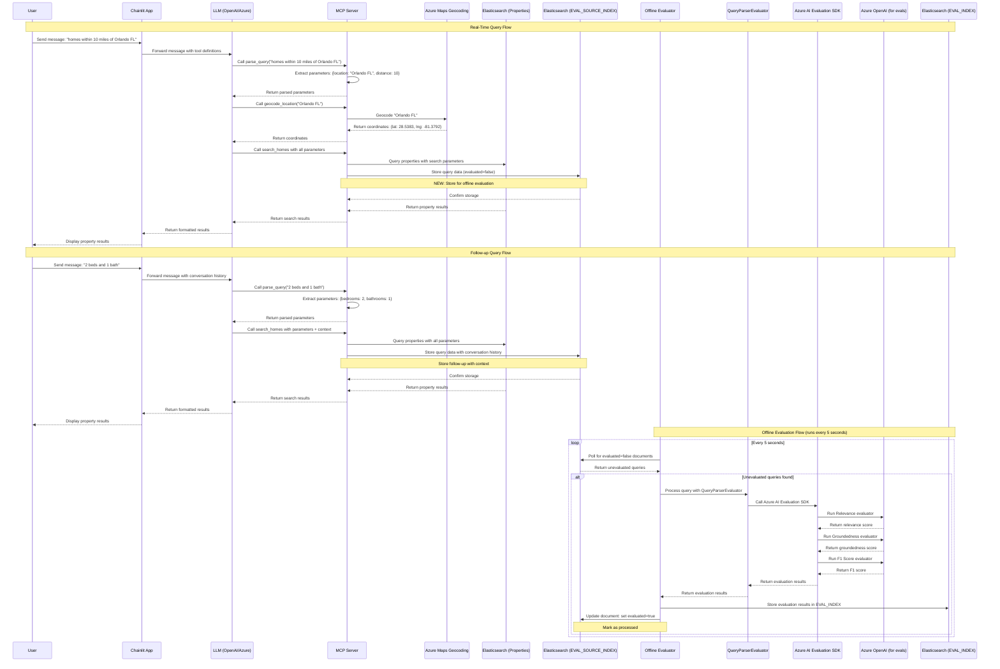

# Offline Evaluation Architecture

This document describes the architecture for moving query evaluation from real-time to offline processing.

## Overview

The evaluation system has been refactored to separate real-time query processing from evaluation processing. This improves user experience by removing evaluation latency from search operations while maintaining comprehensive evaluation capabilities.

## Architecture Diagram



## Key Components

### 1. Real-Time Query Processing
- **Chainlit App**: User interface for home search
- **LLM**: Processes natural language and orchestrates tool calls
- **MCP Server**: Handles tool execution and data storage
- **Azure Maps**: Geocoding service for location coordinates
- **Elasticsearch (Properties)**: Property search and retrieval
- **Elasticsearch (EVAL_SOURCE_INDEX)**: Stores query data for offline evaluation

### 2. Offline Evaluation Processing
- **Offline Evaluator**: Polls for unevaluated queries every 5 seconds
- **QueryParserEvaluator**: Runs Azure AI evaluation SDK
- **Azure AI Evaluation SDK**: Provides evaluation algorithms
- **Azure OpenAI**: LLM service for evaluation scoring
- **Elasticsearch (EVAL_INDEX)**: Stores evaluation results

## Data Flow

### Query Storage (Real-Time)
Each `search_homes` call creates a document in `EVAL_SOURCE_INDEX_NAME`:

```json
{
  "query": "2 beds and 1 bath",
  "parsed_params": {
    "query": "2 beds and 1 bath",
    "bedrooms": 2,
    "bathrooms": 1,
    "latitude": 28.5383,
    "longitude": -81.3792,
    "distance": 10
  },
  "timestamp": "2025-10-22T15:30:45.123Z",
  "trace_id": "abc123def456",
  "span_id": "ghi789jkl012",
  "session_id": "session_xyz789",
  "evaluated": false,
  "conversation_history": [
    {"role": "user", "content": "homes within 10 miles of Orlando FL"},
    {"role": "assistant", "content": "...results..."},
    {"role": "user", "content": "2 beds and 1 bath"}
  ]
}
```

### Evaluation Processing (Offline)
The offline evaluator:
1. Queries `EVAL_SOURCE_INDEX_NAME` for `evaluated=false` documents
2. Processes each query using `QueryParserEvaluator`
3. Stores results in `EVAL_INDEX_NAME` (existing evaluation index)
4. Updates source document with `evaluated=true`

## Benefits

1. **No User Latency**: Evaluation processing doesn't impact search response times
2. **Fault Tolerance**: Evaluation failures don't affect user experience
3. **Scalability**: Evaluation processing can be scaled independently
4. **Reprocessing**: Can reprocess evaluations by resetting `evaluated` flag
5. **Context Preservation**: Maintains conversation history for accurate evaluation

## Setup Instructions

1. **Create Source Index**:
   ```bash
   cd evaluations
   python3 create_eval_source_index.py
   ```

2. **Start Offline Evaluator**:
   ```bash
   cd evaluations
   ./run_offline_eval.sh
   ```

3. **Monitor Evaluation**:
   - Check `EVAL_SOURCE_INDEX_NAME` for `evaluated=false` documents
   - Check `EVAL_INDEX_NAME` for evaluation results
   - Monitor logs for processing status

## Configuration

- **Poll Interval**: 5 seconds (configurable in `offline_evaluator.py`)
- **Batch Size**: 10 queries per poll (configurable)
- **Index Names**: Configured via environment variables
- **Error Handling**: Graceful degradation with retry logic
